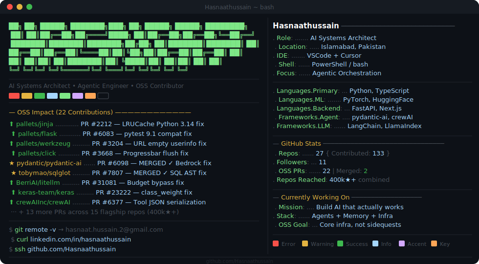
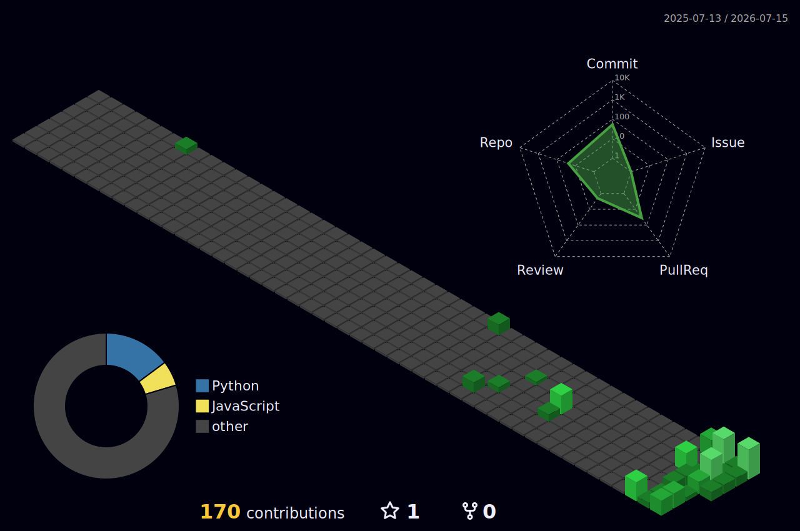

<!-- ╔══════════════════════════════════════════════════════════════════╗ -->
<!-- ║              HASNAAT HUSSAIN — GITHUB PROFILE                   ║ -->
<!-- ╚══════════════════════════════════════════════════════════════════╝ -->

<!-- Neofetch-style terminal card -->

 

---

<!-- ── ABOUT ─────────────────────────────────────────────────────────── -->

<b>$ cat about.md</b>

 
 
I build **AI systems that actually work** — agents, orchestration pipelines, and the infra glue that keeps them running.
 
I spend a lot of time reading source code of projects that millions of people rely on, finding the bugs that nobody noticed, and shipping fixes. Not tutorials. Not wrappers. Core infra.
 
**22 PRs** across flagship Python/AI repos. Merged into `pydantic-ai`, `sqlglot`, `plotly.js`, `ultralytics`, and more. Open in `crewAI`, `keras`, `litellm`, and others.
 

---

<!-- ── 3D CONTRIB GRAPH ──────────────────────────────────────────────── -->

### ◈ Contribution Landscape

---

<!-- ── STREAK & STATS ────────────────────────────────────────────────── -->

### ◈ Streak & Stats

&nbsp;&nbsp;

---

<!-- ── LANGUAGES ─────────────────────────────────────────────────────── -->

### ◈ Languages

---

<!-- ── ACTIVITY GRAPH ────────────────────────────────────────────────── -->

### ◈ Activity

---

<!-- ── OSS CONTRIBUTIONS ─────────────────────────────────────────────── -->

### ◈ Open Source Contributions

| Project | PR | Status | Impact |
|:--------|:---|:------:|:-------|
| **ultralytics/ultralytics** | [#25153](https://github.com/ultralytics/ultralytics/pull/25153) | ✅ Merged | RT-DETR decoder max_det fix |
| **plotly/plotly.js** | [#7768](https://github.com/plotly/plotly.js/pull/7768) | ✅ Merged | Decimal exponent tick precision fix |
| **pydantic/pydantic-ai** | [#6098](https://github.com/pydantic/pydantic-ai/pull/6098) | ✅ Merged | Bedrock user turns attachments fix |
| **tobymao/sqlglot** | [#7807](https://github.com/tobymao/sqlglot/pull/7807) | ✅ Merged | Nested SQLite tuple parsing fix |
| **BerriAI/litellm** | [#31081](https://github.com/BerriAI/litellm/pull/31081) | 🟡 Open | Proxy model discovery budget bypass |
| **keras-team/keras** | [#23222](https://github.com/keras-team/keras/pull/23222) | 🟡 Open | class_weight target labels validation |
| **crewAIInc/crewAI** | [#6377](https://github.com/crewAIInc/crewAI/pull/6377) | 🟡 Open | Tool nested dict return serialization |
| **pandas-dev/pandas** | [#66209](https://github.com/pandas-dev/pandas/pull/66209) | 🟡 Open | Resampling edge alignment fix |
| **run-llama/llama_index** | [#22200](https://github.com/run-llama/llama_index/pull/22200) | 🟡 Open | OneDriveReader sockets timeout |

450k+ combined stars across contributed repositories

---

<!-- ── SNAKE ──────────────────────────────────────────────────────────── -->

### ◈ Contribution Grid

---

<!-- ── METRICS ────────────────────────────────────────────────────────── -->

### ◈ Full Metrics

---

<code>0D1117</code> · Built to last, not to impress · <code>7EE787</code>

