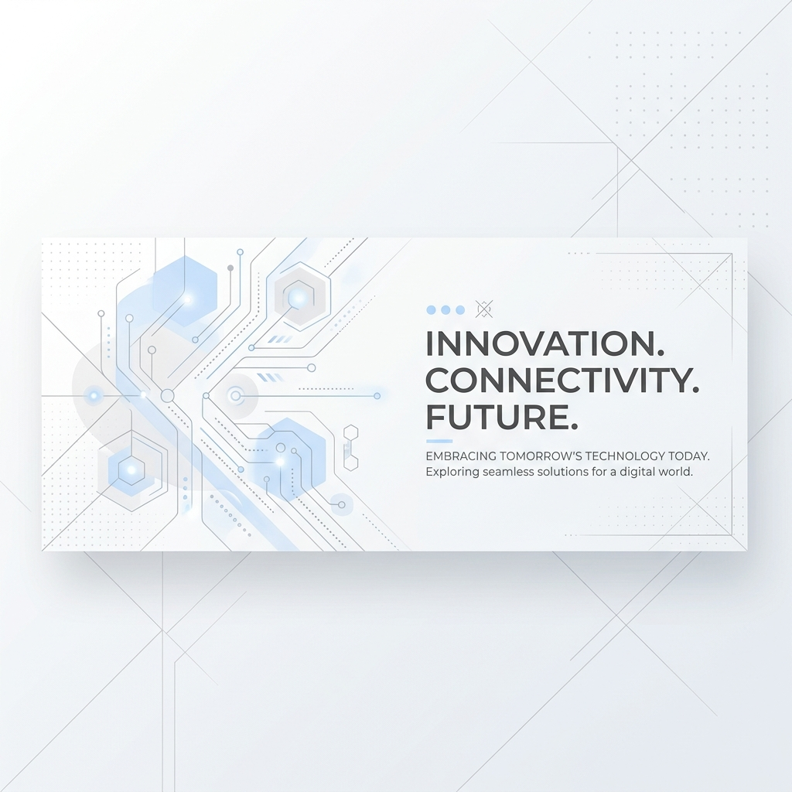

  

<h1 align="center">⚡ HASNAAT HUSSAIN ⚡</h1>

  <strong>AI Systems Architect • Agentic Engineer • Advanced Systems & Algorithms • Full-Stack Developer</strong>

  
  
  
  

---

## 🧬 Engineering Philosophy & Focus

I design and engineer intelligent systems at the intersection of **Generative AI**, **multi-agent orchestration**, and **high-performance backend systems**. I specialize in optimizing LLM routing layers, resolving race conditions and state corruption in agentic memory models, and building reliable, scalable developer tooling.

---

## 🚀 Active Pull Requests & OSS Impact

I actively contribute to the core frameworks powering the modern AI/ML and data visualization ecosystems. Here is my live portfolio:

| Repository | Stars | Contribution | Impact Area & Engineering Solution |
| :--- | :--- | :--- | :--- |
|  **[pydantic/pydantic-ai](https://github.com/pydantic/pydantic-ai)** | `★ 8k+` | [PR #6105](https://github.com/pydantic/pydantic-ai/pull/6105) (Closed) [PR #6096](https://github.com/pydantic/pydantic-ai/pull/6096) (Open) [PR #6098](https://github.com/pydantic/pydantic-ai/pull/6098) (Open) | **Gemini 3, Bedrock Converse, & TestModel metadata:** Gated Gemini 3 tool configurations, resolved Bedrock Converse API `ValidationException` when user turns carry media/attachment files immediately after tool results, and aligned provider name metadata in TestModel responses. |
|  **[bentoml/BentoML](https://github.com/bentoml/BentoML)** | `★ 15k` | [PR #5643](https://github.com/bentoml/BentoML/pull/5643) (Open) | **SDK Robustness:** Prevented index crash when parsing unparameterized bare generic return annotations (like `t.Iterator`, `t.Generator`). |
|  **[AnswerDotAI/fasthtml](https://github.com/AnswerDotAI/fasthtml)** | `★ 10k` | [PR #894](https://github.com/AnswerDotAI/fasthtml/pull/894) (Open) | **Wrapper Isolation:** Renamed internal parameter from `f` to `_f` in `_handle` to prevent keyword parameter naming conflicts when developers accept an `f` parameter in endpoints. |
|  **[tobymao/sqlglot](https://github.com/tobymao/sqlglot)** | `★ 6k` | [PR #7807](https://github.com/tobymao/sqlglot/pull/7807) (Open) | **SQL AST Parser Precision:** Restructured parentheses tuple parsing priorities to retain multiple items inside nested SQLite tuples when containing subqueries. |
|  **[crewAIInc/crewAI](https://github.com/crewAIInc/crewAI)** | `★ 20k` | [PR #6377](https://github.com/crewAIInc/crewAI/pull/6377) (Open) | **Tool Return Validation:** Automatically serialize custom tool outputs containing dictionary/list structures to valid JSON strings to prevent agent runtime failures. |
|  **[BerriAI/litellm](https://github.com/BerriAI/litellm)** | `★ 51.5k` | [PR #31081](https://github.com/BerriAI/litellm/pull/31081) (Open) [PR #31070](https://github.com/BerriAI/litellm/pull/31070) (Open) | **Router Hardening & Discovery Security:** Gracefully prunes unsupported model effort parameters on Anthropic Vertex/Bedrock endpoints, and secured discovery routes to prevent budget leakage for internal developers. |
|  **[plotly/plotly.js](https://github.com/plotly/plotly.js)** | `★ 17k` | [PR #7768](https://github.com/plotly/plotly.js/pull/7768) (Open) | **Formatting Engine Precision:** Resolved broken formatting in `numFormat` logic for extremely small numbers, ensuring reliable decimal/exponential rendering alongside robust Jasmine coverage. |
|  **[getzep/graphiti](https://github.com/getzep/graphiti)** | `★ 7k` | [PR #1604](https://github.com/getzep/graphiti/pull/1604) (Open) | **Context Constraint Control:** Fixed OpenAI-compatible client configurations to dynamically bind `LLMConfig.max_tokens` when integrating local LLM engines (Ollama, vLLM). |
|  **[ashishpatel26/500-AI-Agents-Projects](https://github.com/ashishpatel26/500-AI-Agents-Projects)** | `★ 1.8k` | [PR #109](https://github.com/ashishpatel26/500-AI-Agents-Projects/pull/109) (Open) | **Agent Use Cases Catalog:** Contributed 15 framework-grouped agent use cases across CrewAI, LangGraph, and AutoGen. |
|  **[e2b-dev/awesome-ai-agents](https://github.com/e2b-dev/awesome-ai-agents)** | `★ 4.2k` | [PR #840](https://github.com/e2b-dev/awesome-ai-agents/pull/840) (Open) | **Ecosystem Additions:** Contributed reference links and tool integrations for custom multi-agent execution engines. |
|  **[langchain-ai/langchain](https://github.com/langchain-ai/langchain)** | `★ 100k` | [PR #38382](https://github.com/langchain-ai/langchain/pull/38382) (Closed) | **Multi-Agent Memory Eviction:** Designed a deterministic pruning algorithm in `SummarizationMiddleware` to prevent orphaned `ToolMessage` corruption, blocking downstream HTTP 400 validation issues. |
|  **[huggingface/transformers](https://github.com/huggingface/transformers)** | `★ 130k` | [PR #46793](https://github.com/huggingface/transformers/pull/46793) (Closed) | **Chat Template Resiliency:** Fixed `transformers` generation configurations to robustly handle edge cases with empty conversations, preventing runtime `IndexError` exceptions. |
|  **[keras-team/keras](https://github.com/keras-team/keras)** | `★ 60k` | [PR #22757](https://github.com/keras-team/keras/pull/22757) (Closed) | **Deserialization Validation:** Introduced strict type checks for trainable parameters during Keras deserialization runs to prevent model compile-time issues. |

---

## 🛠️ Interactive Engineering Deep-Dives

Click below to expand and view technical post-mortems of major system bugs I solved:

🤖 <b>Pydantic AI: Code Execution & Native Tools Conflict</b>

 

* **The Problem:** On Gemini 3 models, combining built-in `CodeExecutionTool` with custom user function tools crashed the API (HTTP 400) because `include_server_side_tool_invocations` was never set.
* **The Fix:** Patched the config generator inside the `GoogleModel` adapter to ensure parameters are properly configured when mixing built-in code execution tools with custom local calling routines.

🌐 <b>LiteLLM Proxy: Parameter Pruning & Budget Routing</b>

 

* **The Problem:** Vertex AI and Bedrock backends crashed when router clients passed modern Anthropic parameters (e.g., `thinking`, `output_config`) to models that did not advertise support for them.
* **The Fix:** Configured the Anthropic pass-through endpoint to dynamically strip unsupported effort parameters before routing requests, protecting clients against HTTP 400 validation errors.

📊 <b>Plotly.js: Floating-Point exponential Axis Rounding</b>

 

* **The Problem:** When graphing extremely small numbers where `String(v)` naturally returns exponential notation, Plotly's axis formatting engine sliced directly into the exponent, rendering broken labels.
* **The Fix:** Replaced fragile regex slicing with clean mantissa isolation via `toFixed`, re-attaching the exponent at the end of the formatting pipeline.

🦜🔗 <b>LangChain: Multi-Agent memory state corruption</b>

 

* **The Problem:** When `SummarizationMiddleware` pruned agent history, it cleared parent `AIMessage` objects but left behind orphaned `ToolMessage`s, causing downstream validation crashes.
* **The Fix:** Developed a cohesive pruning algorithm that validates parent-child message bonds to ensure paired messages are evicted together.

---

## 🛠️ Tech Stack & Highlights

  
  
  
  
  
  
  
  
  
  
  
  

---

## 📈 Developer Metrics & Habits

  
  

  

  

  

---

## 💬 Engage & Collaborate

I am always keen to discuss advanced multi-agent orchestrations, systems optimizations, or robust OSS debugging.

  
  
  

  

