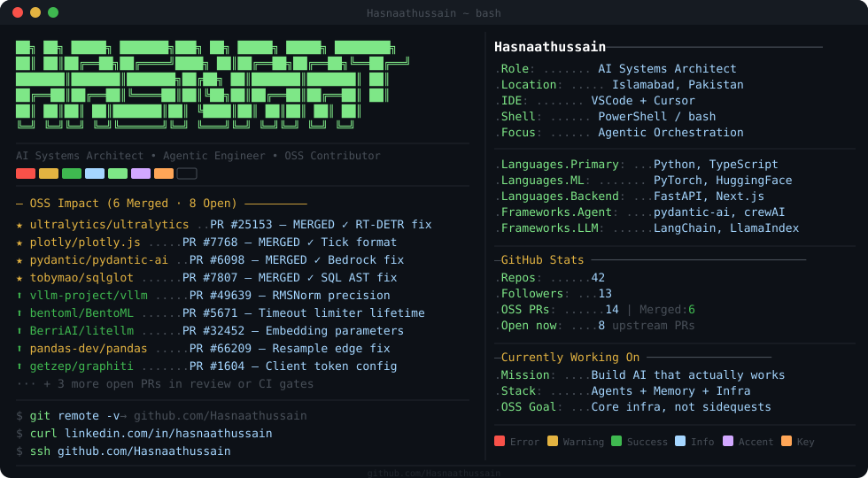
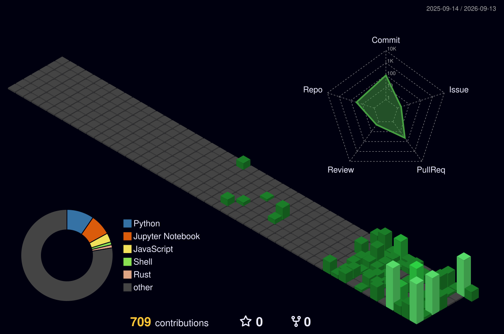

<!-- ╔══════════════════════════════════════════════════════════════════╗ -->
<!-- ║              HASNAAT HUSSAIN — GITHUB PROFILE                   ║ -->
<!-- ╚══════════════════════════════════════════════════════════════════╝ -->

<!-- Neofetch-style terminal card -->

 

---

<!-- ── ABOUT ─────────────────────────────────────────────────────────── -->

<b>$ cat about.md</b>

 
 
I build **AI systems that actually work** — agents, orchestration pipelines, and the infra glue that keeps them running.
 
I spend a lot of time reading source code of projects that millions of people rely on, finding the bugs that nobody noticed, and shipping fixes. Not tutorials. Not wrappers. Core infra.
 
**42 PR-backed contributions audited** across flagship Python/AI repositories. Four are merged upstream; ten remain open with current review or CI state tracked below. The focus is small, tested fixes in inference, serving, tooling, and data systems.
 

---

<!-- ── 3D CONTRIB GRAPH ──────────────────────────────────────────────── -->

### ◈ Contribution Landscape

---

<!-- ── STREAK & STATS ────────────────────────────────────────────────── -->

### ◈ Streak & Stats

&nbsp;&nbsp;

---

<!-- ── LANGUAGES ─────────────────────────────────────────────────────── -->

### ◈ Languages

---

<!-- ── ACTIVITY GRAPH ────────────────────────────────────────────────── -->

### ◈ Activity

---

<!-- ── OSS CONTRIBUTIONS ─────────────────────────────────────────────── -->

### ◈ Open Source Contributions

| Project | PR | Status | Impact |
|:--------|:---|:------:|:-------|
| **ultralytics/ultralytics** | [#25153](https://github.com/ultralytics/ultralytics/pull/25153) | Merged | RT-DETR decoder max_det redesign |
| **plotly/plotly.js** | [#7768](https://github.com/plotly/plotly.js/pull/7768) | Merged | Tick-format exponent precision fix |
| **pydantic/pydantic-ai** | [#6098](https://github.com/pydantic/pydantic-ai/pull/6098) | Merged | Bedrock tool-result attachment fix |
| **tobymao/sqlglot** | [#7807](https://github.com/tobymao/sqlglot/pull/7807) | Merged | Nested SQLite tuple parsing |
| **vllm-project/vllm** | [#49639](https://github.com/vllm-project/vllm/pull/49639) | Open | RMSNorm precision boundary for speculative decoding |
| **bentoml/BentoML** | [#5671](https://github.com/bentoml/BentoML/pull/5671) | Open | Sync timeout capacity-limiter lifetime |
| **crewAIInc/crewAI** | [#6604](https://github.com/crewAIInc/crewAI/pull/6604) | Open | LiteLLM capability-introspection fallback |
| **BerriAI/litellm** | [#32452](https://github.com/BerriAI/litellm/pull/32452) | Open | Embedding dimensions drop-params handling |
| **pandas-dev/pandas** | [#66209](https://github.com/pandas-dev/pandas/pull/66209) | Open | Business-day resampling edge alignment |
| **BentoML** | [#5643](https://github.com/bentoml/BentoML/pull/5643) | Open | Bare generator return-type handling |
| **BerriAI/litellm** | [#31070](https://github.com/BerriAI/litellm/pull/31070) | Open | Anthropic pass-through parameter filtering |
| **getzep/graphiti** | [#1604](https://github.com/getzep/graphiti/pull/1604) | Open | OpenAI generic-client max_tokens config |
| **apache/datafusion** | [#24484](https://github.com/apache/datafusion/pull/24484) | Open | Custom physical-expression inputs in CASE evaluation |
| **Arize-ai/phoenix** | [#15584](https://github.com/Arize-ai/phoenix/pull/15584) | Open | Cursor-paginated large span dataframe exports |
  Live contribution state and DCO/CI audit refreshed 2026-08-22 · 4 upstream merges · 10 open PRs

---

<!-- ── SNAKE ──────────────────────────────────────────────────────────── -->

### ◈ Contribution Grid

---

<!-- ── METRICS ────────────────────────────────────────────────────────── -->

### ◈ Full Metrics

---

<code>0D1117</code> · Built to last, not to impress · <code>7EE787</code>

