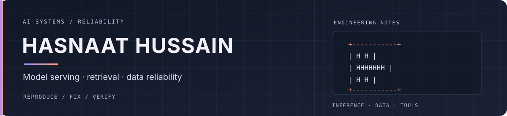

  
  
<strong>AI infrastructure · model serving · retrieval · data reliability</strong>

  

    <a href="https://hasnaat-portfolio-gilt.vercel.app/">Portfolio</a> ·
    <a href="https://github.com/Hasnaathussain?tab=repositories">GitHub projects</a> ·
    <a href="https://github.com/pulls?q=is%3Apr+author%3AHasnaathussain+is%3Aopen">Open pull requests</a>
  

I work on the reliability edges of AI systems: serving, retrieval, and the data paths around them. My open-source contributions focus on small fixes with a clear failure case and a test that keeps it from returning.

### Selected upstream work

| Project | Contribution |
|:--|:--|
| [Ultralytics](https://github.com/ultralytics/ultralytics/pull/25153) | Honor `max_det` in RT-DETR decoder export and validation |
| [Plotly.js](https://github.com/plotly/plotly.js/pull/7768) | Preserve exponent formatting for small tick values |
| [Pydantic AI](https://github.com/pydantic/pydantic-ai/pull/6098) | Handle Bedrock tool results with co-located attachments |
| [SQLGlot](https://github.com/tobymao/sqlglot/pull/7807) | Parse parenthesized multi-expression input as a tuple |
| [MLflow](https://github.com/mlflow/mlflow/pull/25807) | Keep Strands autologging safe around foreign OpenTelemetry spans |
| [Apache DataFusion](https://github.com/apache/datafusion/pull/24484) | Evaluate `CASE` with custom physical-expression inputs |

### Selected projects

- [nn_inference](https://github.com/Hasnaathussain/nn_inference) — C++17 ONNX CPU inference runtime with SIMD GEMM and activation memory planning.
- [OmniChat Showcase](https://github.com/Hasnaathussain/OmniChat-Showcase) — a public case study for a CPU-first multimodal RAG assistant.

---
