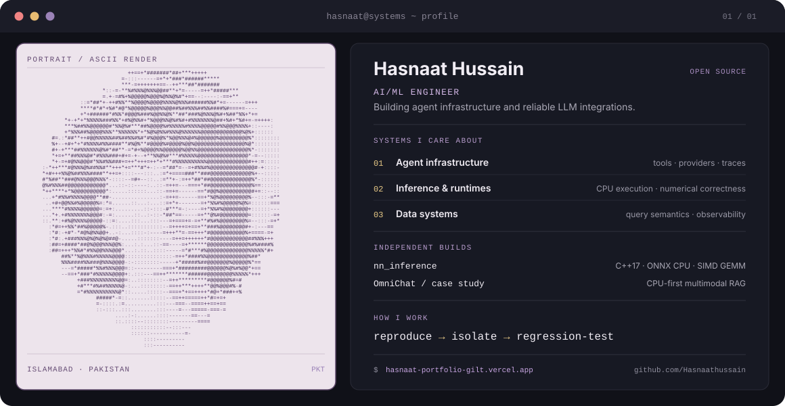

  
  

    <a href="https://hasnaat-portfolio-gilt.vercel.app/">Portfolio</a> ·
    <a href="https://www.linkedin.com/in/hasnaathussain">LinkedIn</a> ·
    <a href="https://github.com/Hasnaathussain?tab=repositories">Projects</a>
  

I work on reliable AI/ML systems: agent infrastructure, provider integrations, inference runtimes, and the data and observability paths around them. I like starting from a concrete failure, narrowing the fix, and leaving a regression test behind.

### Selected upstream work

- [Pydantic AI #6098](https://github.com/pydantic/pydantic-ai/pull/6098) — Bedrock tool results with co-located attachments.
- [MLflow #25807](https://github.com/mlflow/mlflow/pull/25807) — Strands autologging around foreign OpenTelemetry spans.
- [Ultralytics #25153](https://github.com/ultralytics/ultralytics/pull/25153) — RT-DETR `max_det` handling in export and validation.
- [Apache DataFusion #24484](https://github.com/apache/datafusion/pull/24484) — `CASE` evaluation for custom physical expressions.
- [Plotly.js #7768](https://github.com/plotly/plotly.js/pull/7768) — exponent formatting for small tick values.
- [SQLGlot #7807](https://github.com/tobymao/sqlglot/pull/7807) — parenthesized SQLite tuple parsing.

### Independent builds

- [nn_inference](https://github.com/Hasnaathussain/nn_inference) — C++17 ONNX CPU runtime with SIMD GEMM and activation memory planning.
- [OmniChat Showcase](https://github.com/Hasnaathussain/OmniChat-Showcase) — sanitized case study for a CPU-first multimodal RAG assistant.
